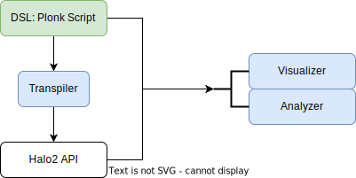

## Transpiler

To achieve programmability, the transpiler borrows the rhai scripting language, which is similar to Rust. The specific work includes the following main steps:
1. Plonk Script -> Rhai: Translates the unique syntax in Plonk Script into rhai code that can be correctly parsed.
2. Rhai -> Rust: Executes rhai code in an embedded way in Rust.
3. Rust -> Halo2 API: During the execution of rhai code, it will call Rust code, which will eventually call the Halo2 API to complete the circuit construction.

## Visualizer
Receives information from both the DSL and the Prover's constraint system, generating corresponding interactive visual effects for logic analysis and tuning.

## Analyzer

The analyzer is a series of tools designed to improve development efficiency, especially debugging efficiency.

### Constraint Boundary Analysis

Analyzes the constraint boundaries of each variable to confirm that the code written is correctly constrained.
Boundary Analysis:

```
- a[0]: None
- a[1]: [0, 1]
- a[2]: [0, 255]
- ...
```

### Error Correction Proposer

Based on the boundary analysis results, it proposes recommended error corrections (specific capabilities still need further consideration).

### Cost Analyzer

Analyzes the proof and verification costs based on the code. Depending on the backend selection, different analysis results will be produced. This will help developers write efficient code, and can also be combined with the recommender to rewrite some common redundant code.
